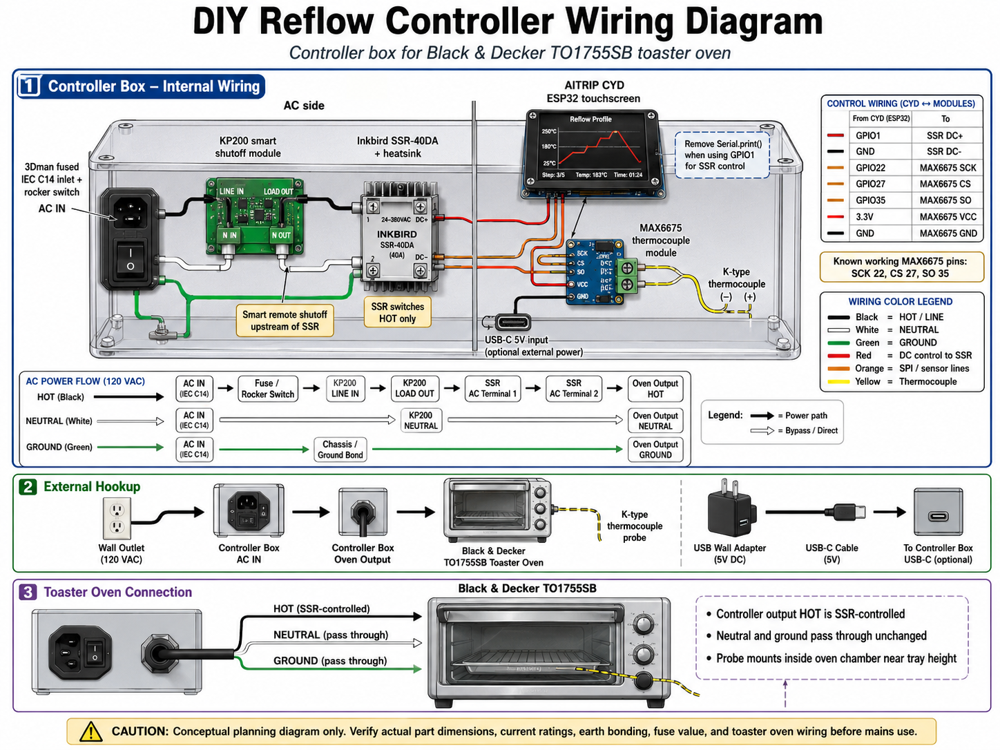

# 🌡️ DIY CYD Reflow Oven Controller

> **⚠️ SAFETY WARNING:** This project involves mains AC voltage, appliance modification, and high heat. Incorrect wiring can cause electric shock, fire, equipment damage, or severe injury. Do not attempt this unless you are experienced and comfortable working with mains AC wiring. Always verify wiring with a meter, confirm current ratings, use proper strain relief, bond ground correctly, and never leave the oven unattended while operating.

## 📖 Overview

This is a custom-built, cost-conscious reflow toaster oven controller designed for soldering Surface Mount Technology (SMT) printed circuit boards. It serves as a lower-cost alternative to reference designs like the [Adafruit EZ Make Oven](https://learn.adafruit.com/ez-make-oven/overview), leveraging the popular [**Cheap Yellow Display (CYD)**](https://www.elecrow.com/2-8inch-esp32-miner-lcd-display-2pcs-cryptocurrency-solo-miner-with-1000kh-s-hashrate.html) ESP32 touchscreen module.

The controller is housed in a standalone, 3D-printed bench enclosure sitting safely adjacent to the toaster oven.

### How It Works

* **Control:** Switches oven heating elements via a Solid State Relay (SSR) using slow-PWM control (2-second window).
* **Sensing:** Reads internal chamber temperatures using a K-type thermocouple paired with a MAX6675 digitizer module.
* **Safety:** A Shelly 1PM Gen4 smart relay sits in the oven's hot conductor as an independent master cutoff with real-time power metering.
* **UI/UX:** Displays live reflow profiles, temperature graphs, and touch targets directly on the CYD screen.

---

## ✨ Features & Project Status

* **Core UI:** CYD Display, capacitive touch, and status LED are fully validated.
* **Sensing:** MAX6675 reading verified with a live rendering graph on the screen.
* **AC Distribution:** ✅ **Validated.** Inlet → Shelly → KP200 branch energized and confirmed. Shelly joins Wi-Fi and reports metering; KP200 powers the CYD via USB adapter; CYD boots on mains power.
* **Control:** Slow-PWM SSR control logic scaffolded. SSR load path (`T2` → oven) not yet connected.
* **Enclosure:** OpenSCAD parametric design optimized to print flat on a Bambu X1C without supports.
* **Safety Isolation:** Internal structural barrier physically separates high-voltage AC mains from low-voltage DC control logic.
* **Triple-layer Fail-safes:** Physical fused rocker switch, a Shelly 1PM Gen4 in the oven's hot path (survives a shorted SSR), and a KP200 controlling CYD supply power.

---

## 🛠️ Bill of Materials (BOM)

| Component | Part / Model | Notes |
| :--- | :--- | :--- |
| **Microcontroller / UI** | [AITRIP CYD ESP32-2432S028R](https://a.co/d/0eqnJxus) | 2.8" resistive touchscreen unit |
| **Toaster Oven** | [Black & Decker TO1313SBD](https://a.co/d/00ZCCpC5) | 1150 W @ 120 V = **9.6 A continuous** |
| **Thermocouple Amp** | [MAX6675 Module + K-Type Thermocouple Probe](https://a.co/d/0htQOedm) | Cold-junction compensated K-type digitizer with probe |
| **Solid State Relay** | [Inkbird SSR-40DA + Aluminum Heatsink](https://a.co/d/078ydj3f) | PID element — chops AC hot line to the oven |
| **Smart Master Relay** | [Shelly 1PM Gen4](https://a.co/d/01A2Ngha) (`S4SW-001P16EU`) | 16 A resistive, power metering, in the oven's hot path |
| **AC Power Inlet** | [3Dman Fused IEC C14 + Rocker Switch](https://a.co/d/0f6DD4BR) | Single-pole rocker, switches hot only |
| **Accessory Outlet** | [KP200 Smart Outlet Module](https://a.co/d/0it13pHO) | **Always-live**, feeds CYD 5 V via USB adapter. Top socket blanked |
| **Oven Feed** | [Female trailing](https://a.co/d/0cmD64dU) lead for power | Exits the 13 mm cable gland on the left side wall |
| **Splices** | [Wago](https://a.co/d/0g3QaYkX) 221-series lever nuts | Ground junction; neutral junction when the oven lead is added |
| **Enclosure Material** | ASA *(Preferred)* / PETG *(Min)* | **Do not use PLA** (susceptible to oven-ambient warp) |

---

## 📁 Repository Structure

```text
CYD-ReFlow-Oven/
├── 3MF/                                            # Slicer-ready, pre-arranged plates
│   └── reflow-enclosure-v9_9-compact-x1.3mf        # Combined slicer assembly setup
├── OpenSCAD/                                       # Parametric physical source CAD
│   └── reflow-enclosure-flat-v10_3-compact-x1c.scad  # ✅ CURRENT master source of record
├── STL/                                            # Individual production-ready meshes
│   ├── reflow-v9_6-bottom.stl                      # Validated structural shell
│   ├── reflow-v9_6-iec-trim-plate.stl              # Dedicated trim alignment plate
│   ├── reflow-v9_9-bezel.stl                       # Top screen bezel mesh
│   └── reflow-v9_9-lid.stl                         # Pre-mirrored mating lid mesh
├── LICENSE                                         # BSD-2-Clause license file
├── README.md                                       # This file
├── diy_reflow_controller_wiring_diagram.png        # Rendered wiring schematic
└── reflow-wiring-diagram.svg                       # Vector wiring asset
```

> ⚠️ **Print Advisory:** Print the **v9.6** variant for your bottom shell/trim plate and the **v9.9** files for the lid and bezel integration. The OpenSCAD master is now **v10.3**; STL exports lag it.

---

## ⚡ System Architecture & Wiring

### Power Flow Topology

The line splits at the inlet. The oven path is switched twice; the accessory path is never switched.

```text
[Mains Wall Power]
       ↓
[3Dman Fused IEC C14 Inlet + Rocker]   ← single-pole, switches HOT only
       ↓
   FUSED HOT  ─────────────┬──────────────────────────────┐
                           ↓                              ↓
             [Shelly 1PM Gen4]  L → O           [KP200 Smart Outlet]
                           ↓                     (always live, never chopped)
                  [SSR Hot-Side Switching]                ↓
                           ↓                      bottom socket
              [13mm cable gland, left wall]              ↓
                           ↓                      [USB adapter] → CYD 5 V
        [Black & Decker Toaster Oven]              top socket blanked
```

**Why the split:** SSRs typically fail *shorted*. Killing the CYD's power cannot stop a welded triac — only a mechanical contact in the oven's own hot conductor can. The Shelly is therefore the primary cutoff. The KP200 remains a useful secondary (cutting CYD power de-energizes GPIO 1 and drops the SSR), and keeping the CYD on an always-live feed means the display and thermocouple readout stay alive during an emergency stop so you can watch the temperature fall.

> 🛑 **Design Rule:** An IEC C14 inlet is an *input* connector. Never use a male inlet as an energized power output. The power feed out to the oven uses a strain-relieved female trailing lead through the 13 mm cable gland (`ac_out_gland_dia`, left wall, y=42, z=18).

### AC Terminal Map

The Shelly's three `L` and two `N` terminals are internally paralleled, so they serve as the distribution junction — no bus bar or splice is needed on hot or neutral.

| From | To |
| :--- | :--- |
| Inlet **red** (switched, fused hot) | Shelly `L` (terminal 1) |
| Shelly `L` (terminal 2) | KP200 **load** |
| Inlet **blue** (neutral) | Shelly `N` (terminal 1) |
| Shelly `N` (terminal 2) | KP200 **neutral** |
| Inlet **yellow** (ground) | Wago 221-413 → KP200 **ground** + SSR heatsink bond |
| Shelly `O` | SSR `T1` |
| SSR `T2` | Oven trailing lead, hot |
| Shelly `SW` | *unconnected — set input to detached* |
| Shelly `L` (terminal 3) | *spare* |

The Shelly has **no ground terminal** — it is double-insulated. The SSR has **no ground terminal** either; only its metal heatsink is bonded, via a ring terminal under a heatsink screw. Never land mains ground on `T3`/`T4` (those are DC control).

### Shelly 1PM Gen4 Configuration

| Setting | Value | Reason |
| :--- | :--- | :--- |
| Power-on default | **Off** | A power blip must never energize the oven; also covers GPIO 1 boot chatter |
| Input mode | Detached / button | `SW` is unconnected |
| Overpower protection | **1400 W** | Hard backstop above the 1150 W nameplate |
| Relay duty | On before a run, off after | Never PWM — 16 A contacts are rated ~10⁵ cycles |

**Watchdog (no scripting required).** Have the CYD call this every 15 s during a run:

```
http://<shelly-ip>/rpc/Switch.Set?id=0&on=true&toggle_after=30
```

Each call re-arms a 30-second auto-off. If firmware hangs or the CYD reboots, the calls stop and the Shelly opens on its own.

**Shorted-SSR detection.** Because the 1PM meters current, a script can trip the relay when it sees meaningful draw while the controller reports idle — the one failure mode the whole safety architecture exists for.

### Wiring Architecture



### Pin Configuration Mapping

The low-voltage control side links the CYD ESP32 to the MAX6675 sensor and the input side of the SSR. Due to hardware resource sharing on the CYD board, specific pins must be used:

| Function | ESP32 GPIO | Connection Target | Design Context / Gotchas |
| :--- | :--- | :--- | :--- |
| **MAX6675 SCK** | **GPIO 22** | Module Clock | Bit-banged SPI. *Do not use GPIO 21* (conflicts with CYD backlight). |
| **MAX6675 CS** | **GPIO 27** | Module Chip Select| Bit-banged SPI |
| **MAX6675 SO** | **GPIO 35** | Module Data Out | Input-only on ESP32 (perfect match for SO) |
| **SSR Control** | **GPIO 1** | SSR `T3` (DC+) | Shared with Hardware Serial TX pin. See warning below. |
| **DC Ground** | **GND** | SSR `T4` (DC−) | Common low-voltage ground reference |

> **Note:** GPIO 1 outputs 3.3 V; the SSR-40DA input is specced 3–32 VDC, so this is in spec with no headroom. If switching proves unreliable, drive the SSR from 5 V through a 2N7000 / AO3400 low-side switch.

**Divider crossings.** The AC/DC barrier has two dedicated 6 mm pass-throughs. Low-voltage lines use these and never route through the AC chamber:

* `ctrl_hole` — y=36, z=15 — SSR control pair (GPIO 1 / GND)
* `pwr_hole` — y=54, z=15 — CYD 5 V / GND

---

## 💻 Firmware & Flashing Rules

### Required Core Libraries

* `TFT_eSPI` (Configured for the respective CYD display controller)
* `XPT2046_Touchscreen`

### 🚨 Critical GPIO 1 / SSR Warning

Because **GPIO 1** is shared with the hardware serial transmit line (`TX`), any active `Serial.print()` statements or bootloader debugging data will rapidly toggle the SSR during boot or runtime.

#### Strict Upload Procedure:

1. **Isolate:** Disconnect the SSR DC+ control wire from GPIO 1 entirely.
2. **Flash:** Confirm all active `Serial.print()` calls are stripped out of production builds, then flash firmware over USB.
3. **Reconnect & Boot:** Reattach the SSR control line, then press the physical `RST` button on the CYD to initiate a clean, deterministic system boot before introducing AC power.

### Startup & Shutdown Order

Because the KP200 feed is always live, the CYD boots the instant the rocker goes on — while GPIO 1 is still chattering. Sequence accordingly:

* **Power up:** rocker on → CYD boots → *then* enable the Shelly.
* **Power down:** Shelly off → *then* rocker off.

---

## 🖨️ Enclosure & 3D Printing Production

The parametric enclosure splits the interior into isolated functional chambers with an internal physical divider wall at `divider_x = 147`.

### Enclosure Revision Milestones

* **v9.5:** CYD mounting hole pattern corrected 82×44 → **77.5×42 mm** (physically measured on the board; clone variants differ from published drawings).
* **v9.6 Platform:** Stabilized the bottom shell architecture; IEC cutout right-sized to the measured insert body (48 × 28.5 mm). Added `reflow-v9_6-iec-trim-plate.stl` retrofit spacer for shells printed with the old oversize cutout.
* **v9.9 Platform:** Refined top tolerances; display window cut now passes the full standoff depth. The lid file is intentionally pre-mirrored for printing so features map correctly when flipped into its installed state. Do not mirror it again in the slicer.
* **v10 / v10.1:** KP200 flush-mount rework from teardown measurements — window right-sized to 46 × 72 mm, yoke ear recesses, captive box-screw clearance. CYD window shift corrected 3 → **1 mm** against the physically validated printed part.
* **v10.3 (Current):** KP200 tab recesses returned to solid 1.2 mm pockets at full plate strength, with 45° sloped lead-in walls and rounded corners. Reverts the v10.2 through-slot construction.

### Slicer Configurations

* **Orientation:** All STL assets are pre-oriented for direct printing. No supports are required.
* **Infill & Perimeters:** Run a minimum of 3 perimeters paired with 30–40% Gyroid infill to handle internal heat-sink structural load.
* **Hardware:** M3 heat-set brass inserts are required for the internal mounting pillars.

---

## 🚧 Roadmap & Known Issues

### Completed Milestones ✅

* [x] Enclosure dimensions coupon-validated against physical AC components.
* [x] Confirmed SSR heatsink lid-clearance margins (8mm vertical buffer).
* [x] Split production prints to v9.6 bottom configurations and v9.9 top closures.
* [x] Successfully printed and verified structural bottom shell.
* [x] CYD screw pattern physically measured and corrected to 77.5 × 42 mm.
* [x] Smart shutoff device selected: Shelly 1PM Gen4 (16 A, metered, terminal-based — resolves the KP200's socket-only output).
* [x] AC distribution wired and energized: inlet → Shelly → KP200 → USB adapter → CYD boots on mains.
* [x] Oven peak current resolved by spec: 1150 W / 9.6 A, comfortably inside the Shelly's 16 A rating.

### Open Action Items 🛠️

**Blocking mains operation with the oven attached:**

* [ ] **Fuse value.** 9.6 A continuous means 5–6 A slow-blow will open on the first preheat ramp. Size 10 A minimum, realistically 12 A.
* [ ] **C14 inlet current headroom.** IEC 60320 C13/C14 is rated 10 A; 9.6 A continuous is 96 % of rating. Evaluate moving to a C20 inlet (16 A) with a 6.3×32 mm time-lag fuse and C19 cord.
* [ ] **Verify inlet lead gauge.** These modules commonly ship 18 AWG, sometimes 20. At 9.6 A in a sealed enclosure, 20 AWG is inadequate and 18 is marginal.
* [ ] **Confirm the fuse is in the hot leg.** Rocker on: hot pin to red reads near zero; pulling the fuse should open *red*, not blue.

**Build:**

* [ ] Connect SSR `T2` to the oven trailing lead and terminate at the cable gland with strain relief.
* [ ] **Verify Shelly physical placement.** The KP200 body keepout (`kp_depth_z = 44`) leaves 15 mm of floor clearance; the Shelly is 16 mm thick. Measure the real KP200 body depth — if under 40 mm the Shelly lies flat beneath it. Otherwise mount it on edge in the pocket between the inlet wire zone and the heatsink (approx. x=95–145, y=34–65), keeping distance from the heatsink given the Shelly's 40 °C ambient limit.
* [ ] Print production v9.9 lid and bezel; check fitment against bottom shell.
* [ ] Choose SSR-to-heatsink retention method (RTV high-temp silicone vs. a printed corral bracket).
* [ ] Finalize oven chassis entry point for the K-type thermocouple probe.
* [ ] Update `diy_reflow_controller_wiring_diagram.png` / `reflow-wiring-diagram.svg` to the split topology.
* [ ] Export v10.3 STLs to replace the lagging v9.6/v9.9 meshes.

**Firmware:**

* [ ] Audit codebase to completely strip out active `Serial` debugging logs.
* [ ] Implement the Shelly watchdog heartbeat (`toggle_after=30`, called every 15 s).
* [ ] Implement `KVS.Set` heating-state publishing for shorted-SSR detection.
* [ ] Design and implement target reflow curve PID logic loops in firmware.

---

## 🛑 Final Safety Checklist Before Mains Power Authorization

Do not connect the device to wall power until every item below is explicitly checked:

- [ ] **Wiring Verification:** Trace out all connections using a digital multimeter on continuity mode.
- [ ] **Mains Orientation:** Explicitly confirm that the SSR switches the **Hot / Line** conductor, *never* the Neutral conductor.
- [ ] **Fuse Leg:** Confirm the inlet's fuse is in series with the hot conductor, not the neutral.
- [ ] **Shelly Default State:** Confirm power-on default is set to **off** before energizing.
- [ ] **Ground Path Bonding:** Confirm solid earth ground continuity from the primary AC wall inlet pin to the KP200, the SSR heatsink, and the external metal oven frame.
- [ ] **Isolation Separation:** Verify low-voltage control lines route only through the divider pass-throughs and never touch the AC chamber.
- [ ] **Touch Protection:** Ensure there are zero exposed live AC terminals or raw wire conductor strands capable of being touched inside the box. `T1` and `T2` on the SSR are live whenever the Shelly relay is closed.
- [ ] **Thermal Clearance:** Ensure the SSR heatsink cooling vents are unblocked and clear.
- [ ] **Logic Verification:** Test the complete firmware logic path with the AC lines fully disconnected to ensure the CYD triggers the relay pin appropriately under mock profiles.
- [ ] **Constant Supervision:** Never leave the modified oven system unmonitored during live operations.

---
